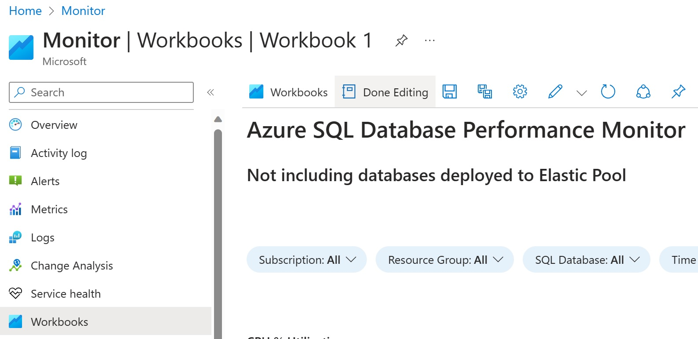

# Azure Monitor Workbooks

Review the Workbooks folder for current collection of Azure Monitor Workbooks

## How to use the workbooks

1. Go to [Azure Portal](https://portal.azure.com)

2. Search for **Monitor** and then click on **Monitor**

    

3. Go to **Workbooks** from the left menu blade on the Azure Monitor Overview page

    

4. Click **New** from the top menu to create a new workbook

    

5. Click **\<\/\>** from the top menu to go to the Advanced Editor

    

6. Replace the json contents with the contents of your workbook file and then click **Apply** to the top right of the editor panel

    

7. Click **Done Editing** from the top menu

    

8. The workbook is now ready to use

    

9. You can save the workbook to a subscription and resource group of your choosing by clicking the **Save** button on the top menu

    

10. Enter a Title, Subscription, Resource group and Location (Region) to the popup blade and then click **Apply**

    

11. To go back to your Azure Monitor workbook at any time just go to your Subscription and Resource group and then click on your workbook (shaded)

    

12. Click **Open Workbook** from the Overview page

    
